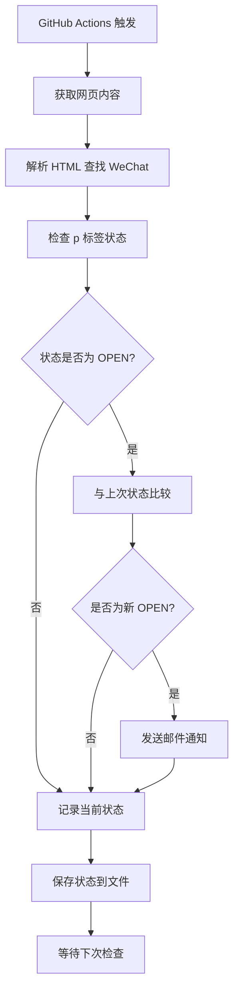

# 🔍 WeChat Status Monitor

[](https://github.com/rlyohh/wechat-monitor/actions)
[](https://www.python.org/downloads/)
[](https://opensource.org/licenses/MIT)

自动监控 [departures.to](https://departures.to/tags/chat) 网站上 WeChat 项目的状态变化，当检测到状态变为 **OPEN** 时自动发送邮件通知。

## ✨ 功能特点

- 🤖 **全自动监控**：基于 GitHub Actions，无需本地运行
- ⚡ **高频检测**：每 5 分钟自动检查一次状态（GitHub Actions 最小间隔）
- 📧 **智能通知**：仅在状态**新变为** OPEN 时发送邮件，避免重复通知
- 💾 **状态记录**：自动记录历史状态，支持状态变化追踪
- 🔗 **完整信息**：邮件包含项目链接、状态信息和检测时间
- 🚀 **一键部署**：Fork 即用free，配置简单
- 🆓 **完全免费**：基于 GitHub 免费服务

## 📋 工作原理



## 🚀 快速开始

### 1. Fork 仓库

点击页面右上角的 "Fork" 按钮，将仓库 Fork 到你的 GitHub 账户。

### 2. 配置邮箱服务

#### QQ 邮箱配置（推荐）

1. 登录 [QQ邮箱网页版](https://mail.qq.com)
2. 点击 **设置** → **账户**
3. 找到 **POP3/IMAP/SMTP/Exchange/CardDAV/CalDAV服务**
4. 开启 **IMAP/SMTP服务**
5. 按提示发送短信获取 **授权码**（16位）
6. 记录授权码备用

#### 其他邮箱配置

| 邮箱服务商 | SMTP 服务器 | 端口 | 说明 |
|-----------|------------|------|------|
| QQ邮箱 | smtp.qq.com | 587 | 需要授权码 |
| 163邮箱 | smtp.163.com | 587/25 | 需要授权码 |
| Gmail | smtp.gmail.com | 587 | 需要应用专用密码 |
| Outlook | smtp-mail.outlook.com | 587 | 使用账户密码 |

### 3. 设置 GitHub Secrets

在你 Fork 的仓库中设置以下 Secrets：

1. 进入仓库页面
2. 点击 **Settings** → **Secrets and variables** → **Actions**
3. 点击 **New repository secret** 添加以下配置：

```
Secret 名称: TO_EMAIL
Secret 值: your-email@qq.com

Secret 名称: FROM_EMAIL  
Secret 值: your-email@qq.com

Secret 名称: EMAIL_PASSWORD
Secret 值: 你的QQ邮箱授权码

Secret 名称: SMTP_SERVER
Secret 值: smtp.qq.com

Secret 名称: SMTP_PORT
Secret 值: 587
```

### 4. 启用 GitHub Actions

1. 进入仓库的 **Actions** 页面
2. 如果看到提示，点击 **"I understand my workflows, go ahead and enable them"**
3. 工作流将自动开始运行

### 5. 手动测试（可选）

1. 进入 **Actions** 页面
2. 选择 **"WeChat Status Monitor"** 工作流
3. 点击 **"Run workflow"** → **"Run workflow"**
4. 查看运行日志确认配置正确

## 📊 监控状态

### 查看运行日志

- 进入 **Actions** 页面查看最近的运行记录
- 点击具体的运行记录查看详细日志
- 绿色 ✅ 表示运行成功，红色 ❌ 表示运行失败

### 日志示例

```
🚀 GitHub Actions - WeChat状态监控
⏰ 运行时间: 2025-01-15 10:30:00 UTC
🔍 检查完成 - 2025-01-15 18:30:00
📊 找到 1 个WeChat项目
🟢 当前OPEN状态: 1 个
🆕 新增OPEN状态: 1 个
  🟢 WeChat: open | https://departures.to/apps/14365
✅ 新OPEN状态邮件通知已发送
📊 监控完成: 发现新状态
```

## 📧 邮件通知示例

当检测到新的 OPEN 状态时，你会收到如下格式的邮件：

```
主题: 🚨 WeChat状态变更通知 - 1个新OPEN状态

内容:
🎉 检测到WeChat状态新变更为OPEN！

⏰ 检测时间: 2025-01-15 18:30:00
🌐 监控网址: https://departures.to/tags/chat
📊 新OPEN状态数量: 1
📈 当前总OPEN数量: 1

📋 新OPEN项目详情:
1. 项目: WeChat
   状态: open
   链接: https://departures.to/apps/14365

💡 提示: 请尽快访问链接查看详情！

🤖 GitHub Actions自动监控系统
```

## ⚙️ 自定义配置

### 修改监控频率

编辑 `.github/workflows/monitor.yml` 文件中的 cron 表达式：

```yaml
schedule:
  - cron: '*/5 * * * *'  # 每5分钟运行
  # - cron: '*/10 * * * *'  # 每10分钟运行
  # - cron: '0 * * * *'     # 每小时运行
```

### 修改监控目标

编辑 `monitor.py` 文件中的以下部分：

```python
# 修改监控的h3标签内容
if h3.get_text(strip=True) == 'WeChat':  # 改为你想监控的项目名

# 修改监控的URL
url = "https://departures.to/tags/chat"  # 改为你想监控的网址
```

### 添加多个收件人

在 GitHub Secrets 中，将 `TO_EMAIL` 设置为多个邮箱（用逗号分隔）：

```
TO_EMAIL: email1@qq.com,email2@gmail.com,email3@163.com
```

## 🔧 故障排除

### 常见问题

**Q: 为什么没有收到邮件？**

- 检查 GitHub Secrets 配置是否正确
- 确认使用的是邮箱授权码，不是登录密码
- 查看 Actions 日志中的错误信息

**Q: GitHub Actions 显示失败？**

- 检查 Python 代码是否有语法错误
- 确认所有必需的 Secrets 都已设置
- 查看具体的错误日志进行调试

**Q: 收到重复的邮件通知？**

- 脚本有状态记录功能，只在新变为 OPEN 时发送邮件
- 如果持续收到重复邮件，检查状态文件是否正常保存

**Q: 想要监控其他项目怎么办？**

- 修改 `monitor.py` 中的项目名称
- 可以扩展代码支持监控多个项目

### 调试技巧

1. **启用详细日志**：在 `monitor.py` 中增加更多 print 语句
2. **手动运行测试**：使用 Actions 页面的手动触发功能
3. **检查网页结构**：确认目标网页的 HTML 结构没有变化

## 📈 使用限制

- **GitHub Actions 免费额度**：个人账户每月 2000 分钟
- **最小运行间隔**：5 分钟（GitHub 限制）
- **并发限制**：免费账户最多同时运行 20 个 job
- **邮件发送频率**：建议不要过于频繁，避免被邮件服务商限制

## 📁 项目结构

```
wechat-monitor/
├── .github/
│   └── workflows/
│       └── monitor.yml          # GitHub Actions 工作流配置
├── monitor.py                   # 主监控脚本
├── requirements.txt             # Python 依赖包
├── last_status.json            # 状态记录文件（自动生成）
├── README.md                   # 项目说明文档
└── LICENSE                     # 开源协议
```

## 📝 更新日志

### v1.0.0 (2025-08-12)

- ✨ 初始版本发布
- 🤖 支持自动监控 WeChat 状态
- 📧 邮件通知功能
- 💾 状态记录和去重
- 🚀 GitHub Actions 自动化部署

## 🤝 贡献

欢迎提交 Issue 和 Pull Request！

1. Fork 本仓库
2. 创建特性分支 (`git checkout -b feature/AmazingFeature`)
3. 提交更改 (`git commit -m 'Add some AmazingFeature'`)
4. 推送到分支 (`git push origin feature/AmazingFeature`)
5. 开启 Pull Request

## 📄 License

本项目采用 MIT 许可证 - 查看 [LICENSE](LICENSE) 文件了解详情

## 🙏 致谢

- [BeautifulSoup](https://www.crummy.com/software/BeautifulSoup/) - HTML 解析
- [Requests](https://docs.python-requests.org/) - HTTP 请求
- [GitHub Actions](https://github.com/features/actions) - 自动化平台

## 🌟 Star History

[](https://www.star-history.com/#rlyohh/wechat-monitor&Date)

---

⭐ 如果这个项目对你有帮助，请给个 Star！

📞 有问题？[提交 Issue](https://github.com/rlyohh/wechat-monitor/issues) 或 [讨论](https://github.com/rlyohh/wechat-monitor/discussions)
